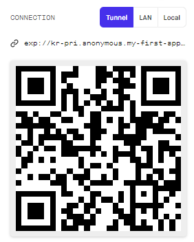
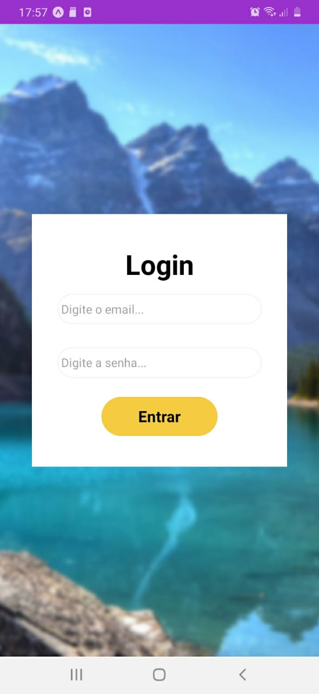

## react_native09
That repository is a project that I did in side classes in the RecodePro Course

## How to run:
- Open the terminal in the folder
- Execute the command **npm install**
- After that execute the command **expo start**
- In the Expo website you're going to see a QR Code
- Download the app 'Expo.go' in your phone (it works either with Android and Iphone)
- Run the App and Scan the QR Code
##### Notice that if your phone is not in the same network of the computer running the aplication you'll need to use the Tunnel option instead of the LAN option
</img>

## Final Result:
###### The final result should look like this:
</img>